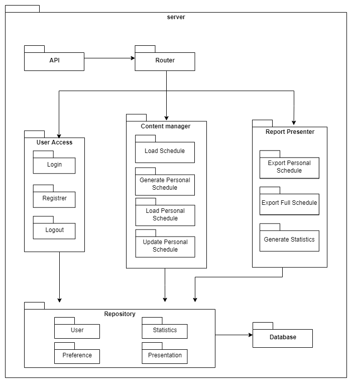

# Визуализатор на събития и генератор на разписание

Тема на проект: 9.3 Генериране на разписание
Подтема 1: Цялостно разписание на предстоящи/презентирали
Подтема 2: Лично разписание – според проявен ‚интерес‘
Подтема 3: Разпечатване на разписанието
Подтема 4: Статистика за системата

Инструкциите за инсталация и структурата на проекта са описани съответно в точки 5 и 8 от документацията.

## Употреба на модулите

